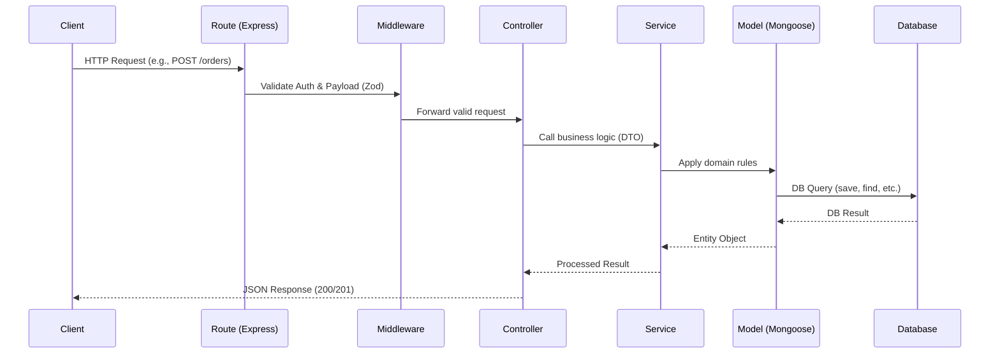
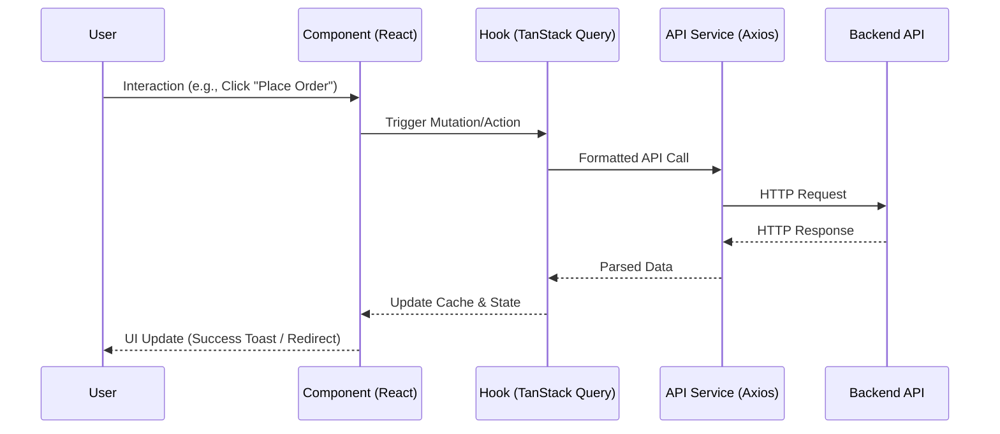

# Architecture & Engineering Blueprint

This document outlines the high-level architecture and engineering principles for the Food Delivery Web Application. We employ a modern MERN stack architecture designed for scalability, maintainability, and clear separation of concerns.

## 1. Clean Architecture

We follow the principles of Clean Architecture, ensuring that our core business logic is isolated from external frameworks, UIs, and databases.

### Layer Diagram

```mermaid
flowchart TD
    subgraph Frameworks & Drivers
        direction TB
        React[React / Vite / Tailwind]
        Express[Express.js / Node.js]
        MongoDB[MongoDB / Mongoose]
        External[Stripe / Socket.IO / Cloudinary]
    end

    subgraph Interface Adapters
        Controllers[Controllers / API Routes]
        Presenters[React Hooks / TanStack Query]
        Gateways[Axios Services / Repositories]
    end

    subgraph Use Cases / Application
        Services[Business Services / Application Logic]
    end

    subgraph Entities / Domain
        Models[Domain Models / TypeScript Interfaces]
        BusinessRules[Core Business Rules]
    end

    Frameworks & Drivers --> Interface Adapters
    Interface Adapters --> Use Cases / Application
    Use Cases / Application --> Entities / Domain

    classDef default fill:#f9f9f9,stroke:#333,stroke-width:2px;
    classDef domain fill:#d4edda,stroke:#28a745,stroke-width:2px;
    classDef usecase fill:#cce5ff,stroke:#007bff,stroke-width:2px;
    classDef adapter fill:#fff3cd,stroke:#ffc107,stroke-width:2px;
    classDef framework fill:#f8d7da,stroke:#dc3545,stroke-width:2px;

    Entities / Domain:::domain
    Use Cases / Application:::usecase
    Interface Adapters:::adapter
    Frameworks & Drivers:::framework
```

### Dependency Rule
Dependencies point **INWARD** only. Inner layers containing business logic do not know anything about the outer layers (UI, databases, frameworks). 
- **Entities/Domain**: Core rules (e.g., A Cart must have a User ID and Items).
- **Use Cases**: Application rules (e.g., Processing an order checkout).
- **Interface Adapters**: Adapting data to/from the Use Cases (e.g., Express Controllers, React hooks).
- **Frameworks/Drivers**: External tools (e.g., MongoDB, React components).

### Backend Architecture Mapping
- **Models**: Mongoose schemas and TypeScript interfaces (Domain/Entities).
- **Services**: Use cases containing business logic (e.g., `OrderService.createOrder()`).
- **Controllers**: Interface adapters parsing HTTP requests and calling Services.
- **Routes**: Framework layer using Express Router.
- **Middleware**: Cross-cutting concerns (authentication, validation, error handling).

### Frontend Architecture Mapping
- **Components**: UI layer (React, shadcn/ui).
- **Hooks**: Application logic and server state management (TanStack Query, custom hooks).
- **Services**: API layer abstracting Axios calls.
- **Types**: Shared domain types and interfaces.
- **Utils**: Helper functions.

---

## 2. MVC Boundaries

While Clean Architecture dictates the overall dependency flow, we apply MVC (Model-View-Controller) patterns within the specific frontend and backend contexts.

| Layer | Backend Context | Frontend Context |
|-------|----------------|------------------|
| **Model** | Mongoose schemas, DB interactions, TS interfaces | TypeScript types, Zod schemas, local/server state |
| **View** | JSON Responses (API is headless) | React components, Pages, Layouts |
| **Controller** | Express route handlers, input validation | React hooks, event handlers, form submissions |

### Backend MVC Flow



### Frontend MVC Flow



---

## 3. Architecture Decision Records (ADRs)

### ADR 1: Clean Architecture for a MERN App
**Decision**: Use Clean Architecture principles rather than a monolithic "fat-controller" approach.
**Rationale**: Food delivery apps have complex domain rules (e.g., order states, restaurant schedules). Decoupling logic into Services allows easier unit testing, avoids vendor lock-in, and scales better as the app grows.

### ADR 2: Feature-Based Folder Structure
**Decision**: Organize code by feature (e.g., `/features/orders/`) instead of by layer (e.g., `/controllers/`, `/models/`).
**Rationale**: Colocating everything related to a specific domain entity (routes, controller, service, model) reduces cognitive load and makes module extraction (e.g., to a microservice) significantly easier in the future.

### ADR 3: TanStack Query vs. Redux/Zustand
**Decision**: Use TanStack Query (React Query) for server state management.
**Rationale**: Redux is overkill for primarily CRUD-based apps. TanStack Query handles caching, background fetching, retries, and optimistic updates out-of-the-box. Local UI state will use standard React Context/Zustand if necessary.

### ADR 4: Zod for Validation
**Decision**: Use Zod for schema validation on both client and server.
**Rationale**: Zod provides strict TypeScript inference. We can share schemas between frontend (React Hook Form) and backend (Express middlewares), ensuring uniform data validation and reducing duplication.

### ADR 5: shadcn/ui vs Material UI
**Decision**: Use shadcn/ui alongside Tailwind CSS.
**Rationale**: shadcn/ui provides accessible, unstyled components that copy directly into the project. This gives us full control over the markup and styling (using Tailwind), unlike MUI which often requires heavy overrides and introduces bloat.
