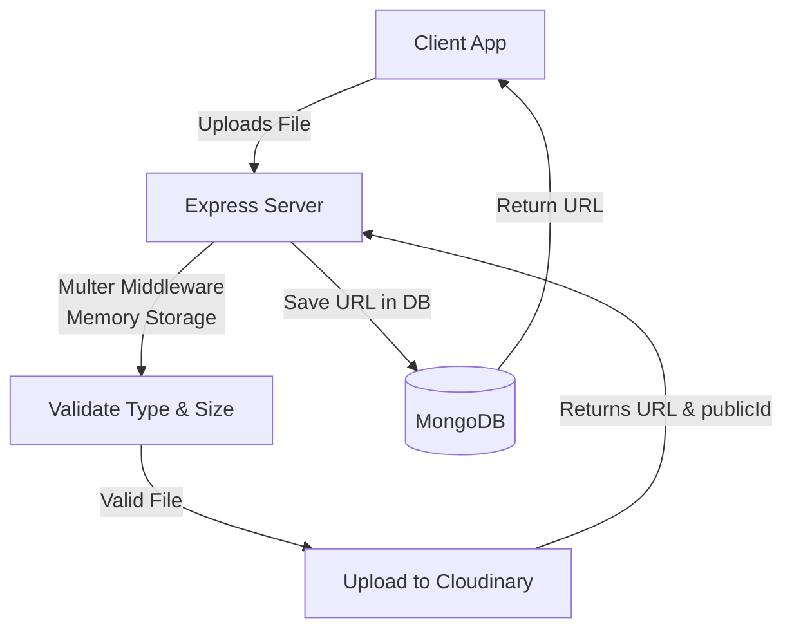

# Cloudinary Integration Plan

## Overview
Cloudinary is used as the centralized media management solution for all image uploads in the Food Delivery Web Application. This includes user avatars, restaurant logos, restaurant cover images, meal images, and category images. We are utilizing the Cloudinary Node.js SDK (`cloudinary` v2).

## Configuration
To connect to Cloudinary, the following environment variables are required:
- `CLOUDINARY_CLOUD_NAME`
- `CLOUDINARY_API_KEY`
- `CLOUDINARY_API_SECRET`

Configuration initialization occurs in `src/config/cloudinary.ts`.

## Upload Architecture


## Folder Structure on Cloudinary
Organizing images by entities ensures clarity and easy management:
```text
food-delivery/
├── avatars/       # User profile images
├── restaurants/
│   ├── logos/     # Restaurant logos
│   └── covers/    # Restaurant cover images
├── meals/         # Meal/food images
└── categories/    # Category images
```

## Image Transformations
Cloudinary transforms images on-the-fly to optimize for performance and layout requirements.

| Use Case | Width | Height | Crop | Quality | Format |
|----------|-------|--------|------|---------|--------|
| Avatar | 200 | 200 | fill | auto | webp |
| Restaurant Logo | 300 | 300 | fill | auto | webp |
| Restaurant Cover | 1200 | 400 | fill | auto | webp |
| Meal Image | 600 | 400 | fill | auto | webp |
| Category Image | 400 | 300 | fill | auto | webp |
| Thumbnail | 150 | 150 | thumb | auto | webp |

## Upload Service Functions
The backend `UploadService` will expose the following operations:
- `uploadImage(file, folder, options)` → Returns `{ url, publicId }`
- `deleteImage(publicId)` → Returns success/failure boolean
- `updateImage(oldPublicId, newFile, folder)` → Returns `{ url, publicId }`

## Security
- **Server-Side Only**: All uploads go through our server to maintain strict access controls (no direct client-to-Cloudinary uploads).
- **Validation**:
  - File types: Restricted to `image/jpeg`, `image/png`, and `image/webp`.
  - Max file size: Capped at `5MB`.
- **Multer Storage**: Configured with memory storage to avoid writing unnecessary files to the local disk, enforcing limits directly in the middleware.

## Error Handling
- **Upload Failure**: Returns `500 Internal Server Error` with a descriptive message.
- **Invalid File Type**: Returns `400 Bad Request` informing the user of allowed types.
- **File Too Large**: Returns `400 Bad Request` specifying the 5MB limit.
- **Cloudinary Service Unavailable**: Retry mechanism or return `503 Service Unavailable`.

## Cleanup Strategy
- **Entity Deletion**: When an entity (e.g., a meal or a user account) is deleted from MongoDB, the associated image must be removed from Cloudinary using its `publicId`.
- **Image Updates**: When a new image replaces an old one, the old image must be deleted from Cloudinary before saving the new reference.
- **Orphan Cleanup**: Periodic jobs to cross-reference Cloudinary assets with the database to clean up orphaned images.
