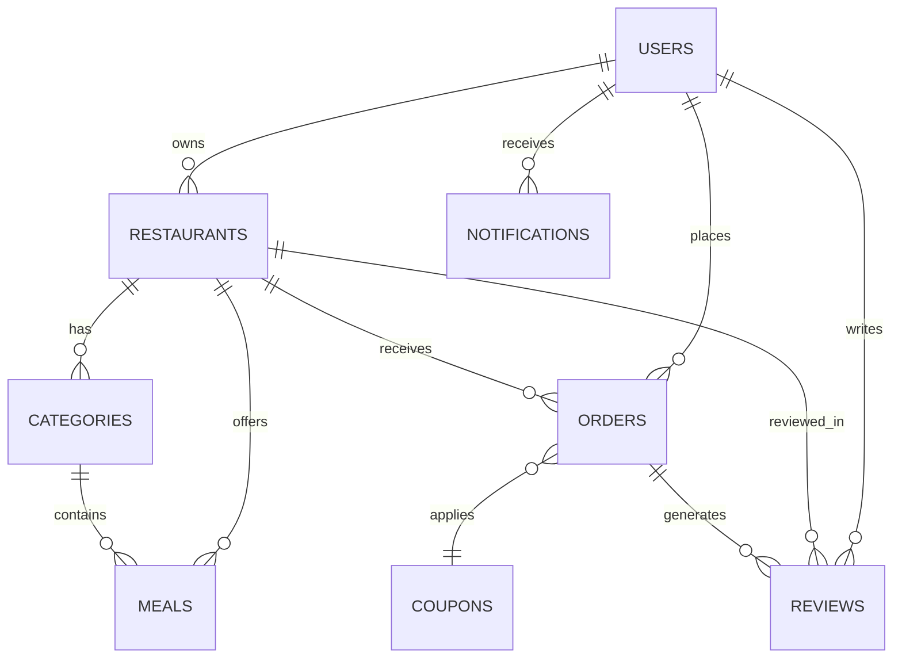

# Database Planning

## Collections Overview

### 1. Users
- **_id**: ObjectId
- **name**: String (required)
- **email**: String (required, unique)
- **password**: String (hashed, required)
- **phone**: String
- **avatar**: String (Cloudinary URL)
- **role**: Enum (customer, restaurant-owner, admin)
- **isEmailVerified**: Boolean (default: false)
- **verificationToken**: String
- **resetPasswordToken**: String
- **resetPasswordExpires**: Date
- **refreshToken**: String
- **addresses**: Array of embedded objects `[{ title, street, city, state, zipCode, isDefault }]`
- **favorites**: Object `{ restaurants: [ObjectId], meals: [ObjectId] }`
- **createdAt**: Date
- **updatedAt**: Date

### 2. Restaurants
- **_id**: ObjectId
- **owner**: ObjectId (ref: Users)
- **name**: String (required)
- **slug**: String (unique)
- **description**: String
- **cuisine**: Array of Strings
- **address**: String
- **location**: GeoJSON `{ type: 'Point', coordinates: [lng, lat] }`
- **phone**: String
- **email**: String
- **logo**: String (Cloudinary URL)
- **coverImage**: String (Cloudinary URL)
- **rating**: Number (average, calculated)
- **totalReviews**: Number
- **isActive**: Boolean (default: true)
- **isApproved**: Boolean (default: false)
- **openingHours**: Object `{ monday: { open, close }, ... }`
- **minimumOrder**: Number
- **deliveryFee**: Number
- **estimatedDeliveryTime**: Number (in minutes)
- **createdAt**: Date
- **updatedAt**: Date

### 3. Categories
- **_id**: ObjectId
- **name**: String (required)
- **slug**: String (unique)
- **description**: String
- **image**: String (Cloudinary URL)
- **restaurant**: ObjectId (ref: Restaurants, optional for global categories)
- **sortOrder**: Number
- **isActive**: Boolean (default: true)
- **createdAt**: Date
- **updatedAt**: Date

### 4. Meals
- **_id**: ObjectId
- **name**: String (required)
- **slug**: String (unique)
- **description**: String
- **price**: Number (required)
- **image**: String (Cloudinary URL)
- **category**: ObjectId (ref: Categories)
- **restaurant**: ObjectId (ref: Restaurants)
- **isAvailable**: Boolean (default: true)
- **isPopular**: Boolean (default: false)
- **preparationTime**: Number (in minutes)
- **ingredients**: Array of Strings
- **allergens**: Array of Strings
- **nutritionInfo**: Object `{ calories, protein, carbs, fat }`
- **createdAt**: Date
- **updatedAt**: Date

### 5. Orders
- **_id**: ObjectId
- **customer**: ObjectId (ref: Users)
- **restaurant**: ObjectId (ref: Restaurants)
- **items**: Array of embedded objects `[{ meal: ObjectId, name: String, price: Number, quantity: Number, image: String }]`
- **status**: Enum (placed, confirmed, preparing, ready, out-for-delivery, delivered, cancelled)
- **deliveryAddress**: Embedded object `{ street, city, state, zipCode }`
- **paymentMethod**: String (stripe, cod)
- **paymentStatus**: Enum (pending, paid, failed, refunded)
- **stripePaymentIntentId**: String
- **subtotal**: Number
- **deliveryFee**: Number
- **tax**: Number
- **discount**: Number
- **total**: Number
- **coupon**: ObjectId (ref: Coupons)
- **notes**: String
- **estimatedDeliveryTime**: Date
- **actualDeliveryTime**: Date
- **cancelReason**: String
- **createdAt**: Date
- **updatedAt**: Date

### 6. Reviews
- **_id**: ObjectId
- **user**: ObjectId (ref: Users)
- **restaurant**: ObjectId (ref: Restaurants)
- **order**: ObjectId (ref: Orders)
- **rating**: Number (1-5)
- **comment**: String
- **createdAt**: Date
- **updatedAt**: Date

### 7. Coupons
- **_id**: ObjectId
- **code**: String (unique)
- **description**: String
- **discountType**: Enum (percentage, fixed)
- **discountValue**: Number
- **minimumOrder**: Number
- **maximumDiscount**: Number
- **startDate**: Date
- **endDate**: Date
- **usageLimit**: Number
- **usedCount**: Number (default: 0)
- **isActive**: Boolean (default: true)
- **applicableRestaurants**: Array of ObjectId (ref: Restaurants)
- **createdAt**: Date
- **updatedAt**: Date

### 8. Notifications
- **_id**: ObjectId
- **user**: ObjectId (ref: Users)
- **type**: Enum (order, system, promotion)
- **title**: String
- **message**: String
- **data**: Mixed (any additional payload)
- **isRead**: Boolean (default: false)
- **createdAt**: Date (TTL index here for auto-cleanup)

## Indexing Strategy

| Collection | Index Fields | Index Type | Purpose |
|------------|-------------|------------|---------|
| Users | `email` | Unique | Ensure unique emails and fast lookups |
| Users | `resetPasswordToken` | Single | Fast lookup for password resets |
| Restaurants | `slug` | Unique | SEO friendly URLs and fast lookup |
| Restaurants | `owner` | Single | Find restaurants by owner |
| Restaurants | `location` | 2dsphere | Geospatial queries for nearby restaurants |
| Categories | `slug` | Unique | Fast lookup |
| Categories | `restaurant` | Single | Query categories by restaurant |
| Meals | `restaurant`, `category` | Compound | Fast filtering of a restaurant's menu |
| Meals | `name`, `description` | Text | Full-text search for meals |
| Orders | `customer`, `createdAt` | Compound | User order history sorted by date |
| Orders | `restaurant`, `status` | Compound | Dashboard queries for active orders |
| Reviews | `restaurant` | Single | Fetching reviews for a restaurant |
| Reviews | `user`, `order` | Compound Unique | One review per user per order |
| Coupons | `code` | Unique | Fast validation of coupons |
| Notifications | `user`, `createdAt` | Compound | Fetch user notifications sorted by latest |
| Notifications | `createdAt` | TTL | Auto-expire old notifications (e.g., after 30 days) |

## Relationships Diagram

## Data Validation Rules

**Mongoose-level Validations:**
- **Users**: Email format validation (Regex), Password minimum length (8 chars), Role restriction.
- **Restaurants**: Valid URL format for images, GeoJSON validity for location, Min/Max length for names.
- **Meals**: Price must be >= 0, Preparation time must be >= 0.
- **Orders**: Minimum order items length of 1, valid payment statuses.
- **Reviews**: Rating strictly between 1 and 5.
- **Coupons**: Discount value must be valid based on type (e.g., percentage <= 100), endDate > startDate.

**MongoDB Schema Validations:**
- Enforce strict schemas at the database level to prevent malformed inserts from bypass methods.
- Make required fields mandatory (`bsonType: "string"`, `bsonType: "objectId"`).

## Embedding vs Referencing Decisions

- **Addresses embedded in Users**: A user typically has a small, bounded number of addresses (home, work, etc.). They are always accessed together with the user profile, making embedding efficient.
- **Order items embedded in Orders**: Order items represent a historical snapshot. If a meal's price or name changes later, it should not affect past orders. Denormalizing and embedding the meal data inside the order ensures data integrity over time.
- **Reviews as separate collection**: Reviews can grow unboundedly per restaurant. Embedding them would breach the 16MB document limit and make pagination extremely difficult. A separate collection allows for easy querying and pagination.
- **Categories as separate collection**: Categories can be shared across multiple views and meals. Having them as a separate collection normalizes the data and makes it easier to manage sorting and active states independently of meals.
- **Notifications as separate collection**: Users can receive a high volume of notifications. Storing them separately prevents the user document from growing too large. A TTL index can be applied to auto-delete old notifications.
