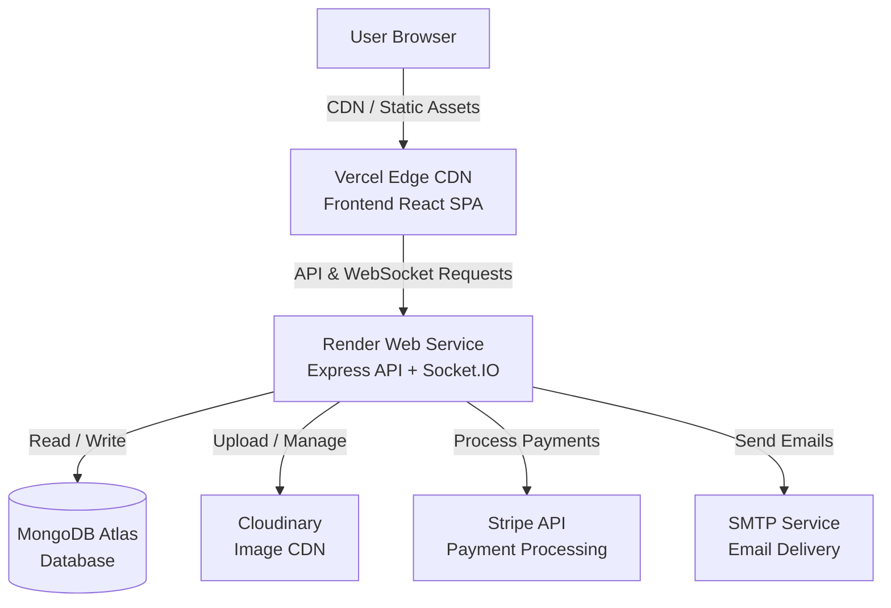

# Deployment Architecture

## Overview
This document outlines the deployment strategy, environments, and CI/CD pipeline for the Food Delivery Web Application.

## Architecture Diagram

## Frontend Deployment (Vercel)
- **Framework**: Vite (auto-detected by Vercel).
- **Build Command**: `npm run build`
- **Output Directory**: `dist`
- **Environment Variables**: `VITE_API_URL`, `VITE_STRIPE_PUBLISHABLE_KEY`, `VITE_SOCKET_URL`.
- **Routing**: SPA rewrites configured in `vercel.json` to route all non-file paths to `index.html`.
- **Features**: Preview deployments for Pull Requests and custom domain setup.

## Backend Deployment (Render)
- **Service Type**: Web Service.
- **Build Command**: `npm install && npm run build`
- **Start Command**: `npm start`
- **Environment**: Node.js.
- **Environment Variables**: All backend secrets (`MONGODB_URI`, `JWT_SECRET`, `STRIPE_SECRET_KEY`, etc.).
- **Health Check**: Configured endpoint `GET /api/v1/health`.
- **Deployment**: Auto-deploy from the `main` branch.
- *Note*: Be aware of spin-down and cold starts if running on the free tier.

## Database (MongoDB Atlas)
- **Cluster Tier**: `M0` (free) for development, `M10+` for production.
- **Region**: Geographically collocated with the Render backend region for minimal latency.
- **Network Access**: IP whitelist configured to Render's IP addresses (or `0.0.0.0/0` on free tier where static IPs aren't supported).
- **Security**: Separate database users for development and production.

## Environment Configuration

| Variable | Dev Value | Prod Value | Where |
|----------|-----------|------------|-------|
| `NODE_ENV` | `development` | `production` | Backend |
| `PORT` | `5000` | *(auto provided by Render)* | Backend |
| `MONGODB_URI` | `mongodb://localhost:27017/local` | Atlas connection string | Backend |
| `JWT_SECRET` | `dev-secret` | Strong random string | Backend |
| `JWT_REFRESH_SECRET`| `dev-refresh-secret` | Strong random string | Backend |
| `CLIENT_URL` | `http://localhost:5173` | `https://fooddelivery.vercel.app` | Backend |
| `CLOUDINARY_*` | Dev credentials | Prod credentials | Backend |
| `STRIPE_*` | Test keys | Live keys | Both |
| `VITE_API_URL` | `http://localhost:5000/api/v1` | `https://api.render.com/api/v1` | Frontend |

## CI/CD Pipeline
- **Vercel**: Automatically triggers a frontend build and deployment on push to `main`.
- **Render**: Automatically triggers a backend build and deployment on push to `main`.
- **Branch Previews**: Handled by Vercel for frontend PRs.
- **Pre-deploy Checks**: Build steps include linting (`npm run lint`) and TypeScript type-checking to prevent broken deployments.

## Monitoring & Health
- **Health Check Endpoint**: `/api/v1/health` returns `{ status: 'ok', uptime, timestamp }`.
- **Logging**: Render's built-in logs and metric dashboards.
- **Database**: MongoDB Atlas monitoring for connections, query operations, and storage metrics.

## Security in Deployment
- **HTTPS everywhere**: Vercel and Render provide free, automatic SSL certificates.
- **Secrets Management**: Environment variables are strictly injected via the hosting platform dashboards and never hardcoded in the repository.
- **CORS**: Backend restricts Cross-Origin requests strictly to the production frontend domain (`CLIENT_URL`).
- **Database Whitelisting**: Network-level security on MongoDB Atlas.

## Scaling Strategy
| Component | Current | Scale Option |
|-----------|---------|-------------|
| Frontend | Vercel Edge | Automatic (Globally distributed CDN) |
| Backend | Single Render Instance | Render auto-scale / Provision multiple instances |
| Database | M0 Atlas | Vertical scaling to M10-M60 or Sharding |
| WebSocket | In-memory adapter | Redis adapter to sync state across instances |
