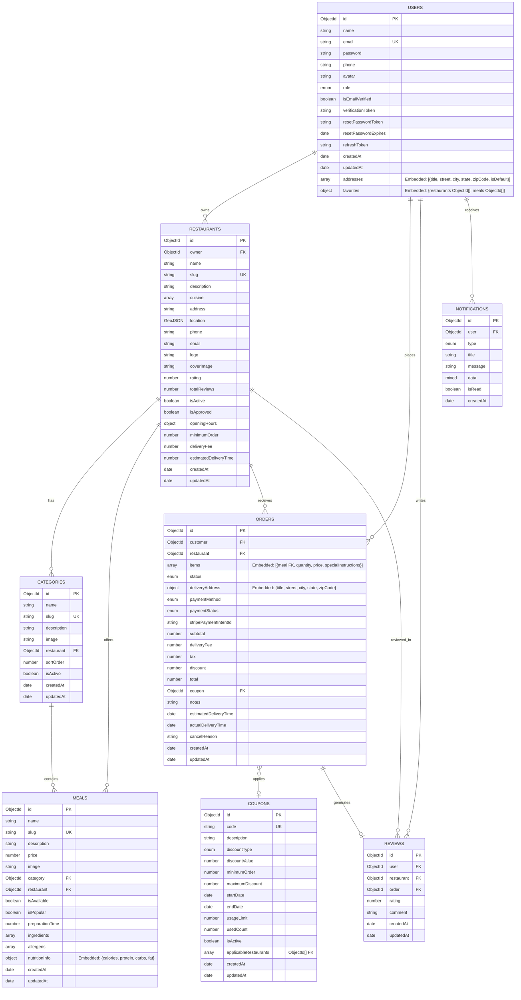

# Entity-Relationship Diagram

This document presents the detailed Entity-Relationship (ER) model for the Food Delivery Web Application.

## Mermaid Diagram

## Cardinality Summary Table

| Entity (Source) | Relationship | Entity (Target) | Cardinality | Description |
|---|---|---|---|---|
| **User** | owns | **Restaurant** | 1 : N (One-to-Many) | A user (with RestaurantOwner role) can own multiple restaurants. |
| **User** | places | **Order** | 1 : N (One-to-Many) | A user (Customer) can place multiple orders over time. |
| **User** | writes | **Review** | 1 : N (One-to-Many) | A user can write multiple reviews for different restaurants. |
| **User** | receives | **Notification**| 1 : N (One-to-Many) | A user can receive multiple notifications. |
| **Restaurant** | has | **Category** | 1 : N (One-to-Many) | A restaurant has multiple menu categories (e.g., Starters, Mains). |
| **Restaurant** | offers | **Meal** | 1 : N (One-to-Many) | A restaurant offers multiple meals on its menu. |
| **Restaurant** | receives | **Order** | 1 : N (One-to-Many) | A restaurant receives multiple orders from different customers. |
| **Restaurant**| reviewed_in | **Review** | 1 : N (One-to-Many) | A restaurant accumulates multiple reviews from customers. |
| **Category** | contains | **Meal** | 1 : N (One-to-Many) | A category categorizes multiple meals. |
| **Order** | applies | **Coupon** | N : 1 (Many-to-One) | Multiple orders can use the same coupon, but an order has at most one coupon. |
| **Order** | generates | **Review** | 1 : 1 (One-to-One) | An order can generate at most one review to ensure verified purchases. |
