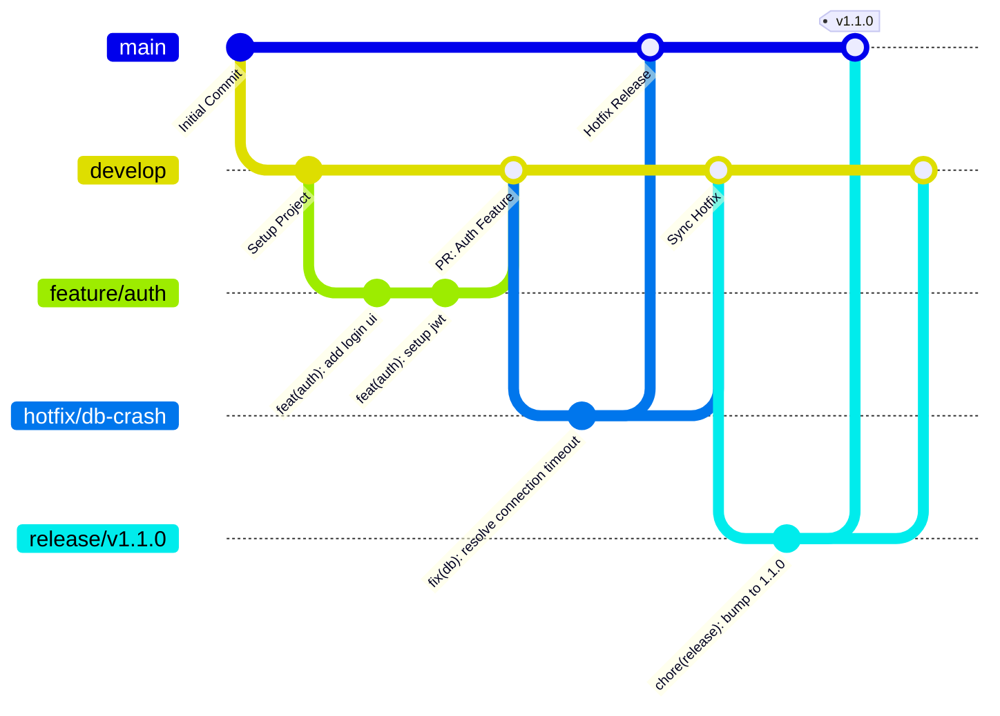

# Git Workflow & Version Control

This document outlines the standard Git workflow, commit conventions, and pull request processes for the Food Delivery App project.

## 1. Branch Strategy (Git Flow Variant)

We use a simplified version of Git Flow. This provides a balance between structure for releases and agility for continuous integration.

### Core Branches
- `main` — **Production-ready**. Represents the live state of the app. Protected branch.
- `develop` — **Integration branch**. All feature branches merge here. Deployed to the staging environment.

### Supporting Branches
- `feature/*` — Used for new features (e.g., `feature/auth-login`, `feature/cart-checkout`). Branch off `develop`, merge back to `develop`.
- `bugfix/*` — Used for non-critical bug fixes found during QA on `develop`.
- `hotfix/*` — Urgent fixes for production. Branch off `main`, merge back to **both** `main` and `develop`.
- `release/*` — Preparation for a new production release (version bumping, final docs). Branch off `develop`, merge to `main` and `develop`.

### Visual Workflow



---

## 2. Commit Convention (Conventional Commits)

We enforce standard **Conventional Commits** to auto-generate changelogs and maintain a readable history.

**Format:**
```
type(scope): description

[optional body]

[optional footer(s)]
```

### Types
- `feat` - A new feature (correlates with MINOR in SemVer)
- `fix` - A bug fix (correlates with PATCH in SemVer)
- `docs` - Documentation only changes
- `style` - Changes that do not affect meaning (white-space, formatting)
- `refactor` - A code change that neither fixes a bug nor adds a feature
- `perf` - A code change that improves performance
- `test` - Adding missing or correcting existing tests
- `chore` - Changes to the build process or auxiliary tools/libraries
- `ci` - Changes to CI/CD configuration files and scripts

### Scopes (Specific to this project)
`auth`, `restaurants`, `meals`, `orders`, `cart`, `payments`, `admin`, `ui`, `config`, `db`.

### Examples
- `feat(auth): implement JWT refresh token rotation`
- `fix(cart): prevent adding out-of-stock meals to cart`
- `chore(config): update tailwind color palette`
- `docs(api): add swagger documentation for orders endpoint`

---

## 3. Pull Request (PR) Process

Code is never pushed directly to `develop` or `main`. All changes must go through a Pull Request.

### Review Requirements
1. **Approval**: At least 1 approved review from a team member.
2. **CI Passing**: All automated checks (Linting, TypeScript compilation, Unit Tests) must pass.
3. **No Conflicts**: Branch must be up-to-date with the target branch (`develop` or `main`).

### PR Merge Strategy
- **Feature to Develop**: `Squash and Merge`. This keeps the `develop` history clean (one commit per feature).
- **Develop to Main**: `Merge Commit`. Preserves the historical context of what features were batched in the release.

### Standard PR Template
When opening a PR, the following template should be filled out:

```markdown
## Description
Provide a brief summary of the changes. Link to relevant Jira/Trello ticket.

## Type of Change
- [ ] Bug fix (non-breaking change)
- [ ] New feature (non-breaking change)
- [ ] Breaking change (fix or feature that breaks existing functionality)
- [ ] Documentation update

## Checklist
- [ ] My code follows the style guidelines of this project (ESLint/Prettier).
- [ ] I have performed a self-review of my code.
- [ ] I have added/updated Swagger docs (if applicable).
- [ ] I have added tests that prove my fix/feature works.
```

---

## 4. Branch Protection Rules (GitHub / GitLab)

Repository settings should enforce the following:

- **`main`**:
  - Require pull request reviews before merging.
  - Require status checks to pass before merging.
  - Do not allow bypassing the above settings.
  - Disallow force pushes (`git push --force`).
- **`develop`**:
  - Require pull request reviews before merging.
  - Require CI pipelines to pass.
  - Disallow force pushes.

---

## 5. Versioning (Semantic Versioning)

We follow **SemVer (Semantic Versioning)** for tagging releases on the `main` branch: `MAJOR.MINOR.PATCH`.

- **MAJOR (`1.0.0`)**: Incompatible API changes, massive system overhauls.
- **MINOR (`0.1.0`)**: Backwards-compatible functionality added (e.g., adding a new `Coupons` feature).
- **PATCH (`0.0.1`)**: Backwards-compatible bug fixes.

**Version Bumps per Phase:**
- `v0.1.0-alpha`: Phase 1 & 2 completed (Setup & Auth).
- `v0.5.0-beta`: Phase 3 & 4 completed (Core Marketplace & Checkout).
- `v1.0.0`: Production Ready (All phases, testing, and deployment completed).
