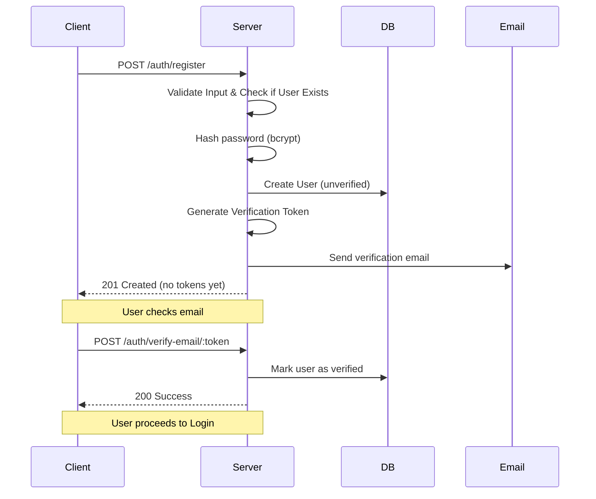
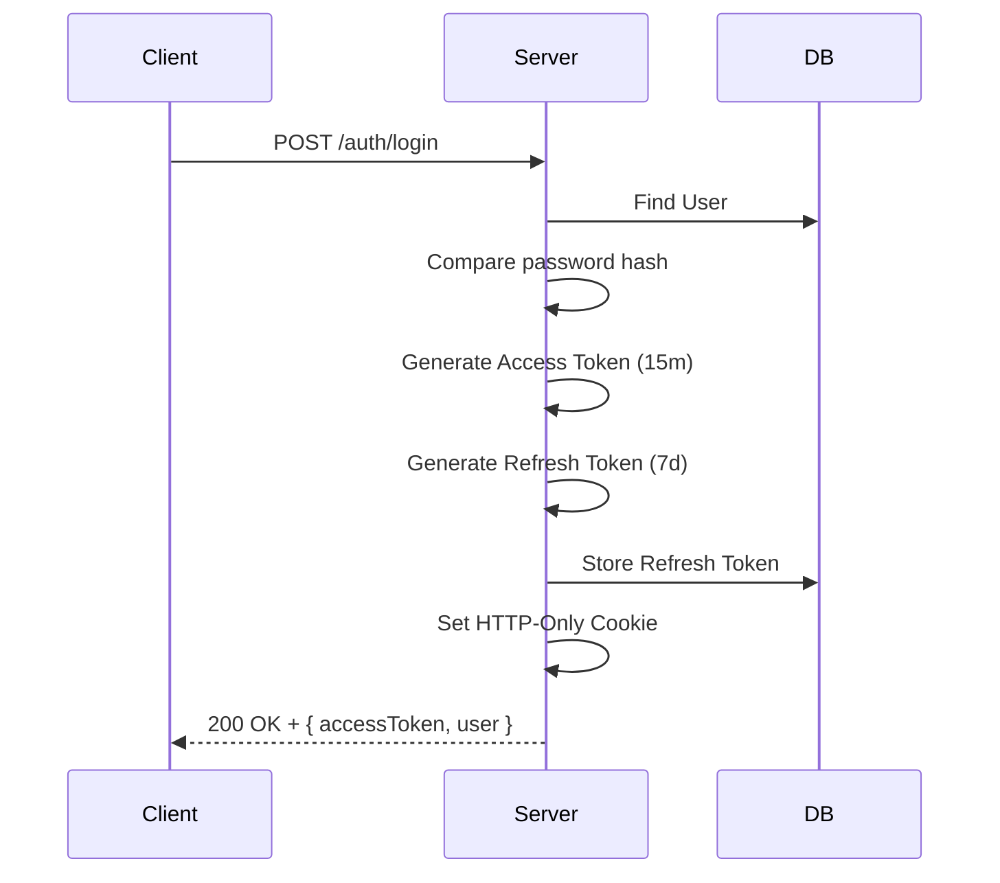
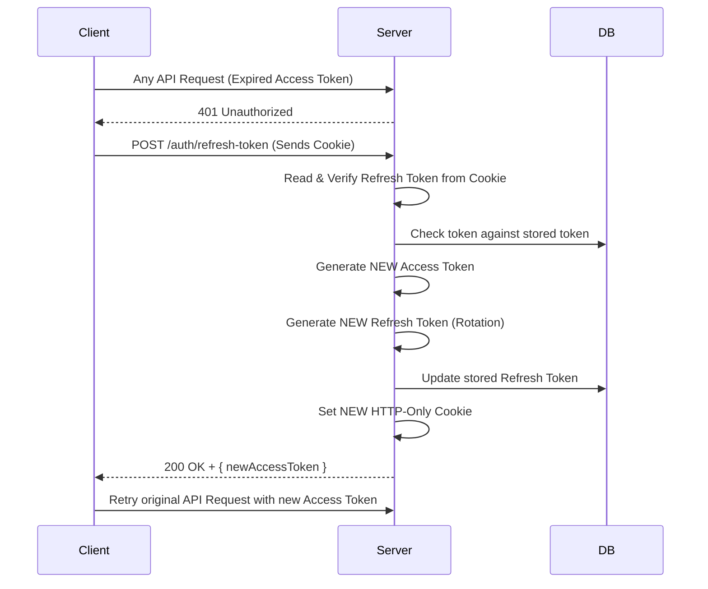
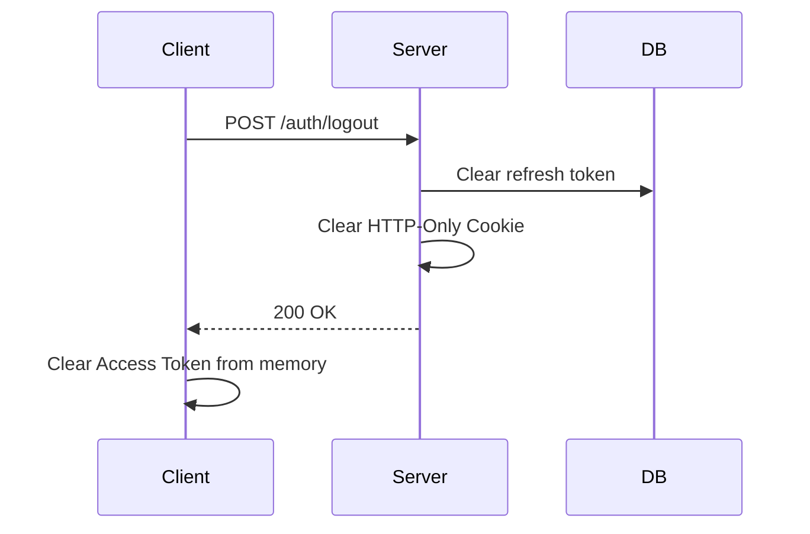
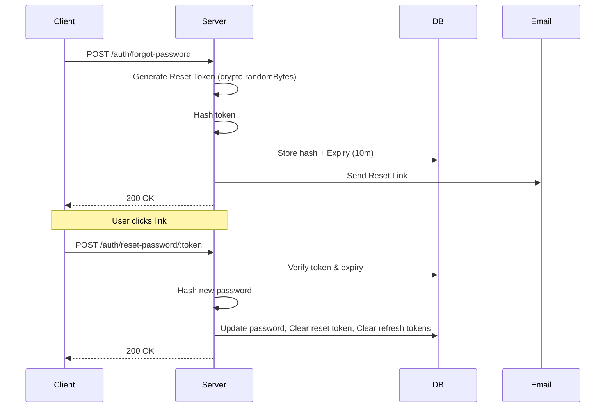

# JWT & Refresh Token Design

This document details the authentication and authorization token lifecycle for the application.

## Token Architecture

The application uses a dual-token architecture to balance security and user experience.

### Access Token
- **Payload:** `{ userId, email, role }`
- **Algorithm:** `HS256`
- **Expiry:** 15 minutes
- **Storage:** Client memory (JavaScript variable) — **NOT** `localStorage` or `sessionStorage` to prevent XSS extraction.
- **Transport:** Sent via the `Authorization` header as a Bearer token (`Authorization: Bearer <token>`).

### Refresh Token
- **Payload:** `{ userId }`
- **Algorithm:** `HS256`
- **Expiry:** 7 days
- **Storage:** HTTP-only, `Secure`, `SameSite=Strict` cookie. Server sets it, client browser stores it.
- **Transport:** Sent automatically by the browser via Cookie header on requests to the same origin.
- **Database Storage:** Stored securely in the `Users.refreshToken` field for revocation and rotation management.

---

## Authentication Flows

### 1. Registration Flow

### 2. Login Flow

### 3. Token Refresh Flow

### 4. Logout Flow

### 5. Password Reset Flow

---

## Middleware Design

- **`protect` Middleware:**
  - Extracts the access token from the `Authorization` header.
  - Verifies the token signature and expiration.
  - Fetches the user from the database.
  - Attaches the user object to `req.user`.
  - Returns `401 Unauthorized` if the token is missing, invalid, or expired.

- **`authorize(...roles)` Middleware:**
  - Evaluates `req.user.role`.
  - Checks if the user's role is included in the permitted `roles` array.
  - Returns `403 Forbidden` if unauthorized.

---

## Token Refresh Strategy (Frontend)

To provide a seamless user experience, token refresh is handled invisibly by the frontend client:

1. **Axios Interceptor:** An interceptor watches for `401 Unauthorized` responses.
2. **Refresh Attempt:** If a `401` is received, the interceptor automatically calls `/auth/refresh-token`.
3. **Queueing:** While the refresh request is in progress, any other outgoing API requests are paused and queued.
4. **Retry:** Upon a successful refresh, the new access token is stored in memory, and the queued requests are retried with the new token.
5. **Failure Handling:** If the refresh request itself fails (e.g., refresh token is expired or invalid), the user is redirected to the login page, and their local state is cleared.
6. **Silent Refresh on Load:** When the app first loads, it attempts a silent refresh to automatically log the user in if a valid session exists.

---

## Security Considerations

- **XSS Protection:** Storing the access token in memory instead of `localStorage` ensures that malicious scripts cannot trivially extract the token.
- **CSRF Mitigation:** The refresh token cookie is flagged `SameSite=Strict`, mitigating Cross-Site Request Forgery (CSRF) attacks. Furthermore, the refresh endpoint only returns a token and does not mutate application state.
- **Token Rotation:** Issuing a new refresh token upon every refresh event protects against token theft. If a stolen token is used, it will invalidate the current token, prompting the legitimate user to re-authenticate and alerting the system to potential compromise.
- **Server-Side Revocation:** The logout process, password reset, and role changes explicitly clear the refresh token from the database, ensuring immediate revocation of access capabilities.
