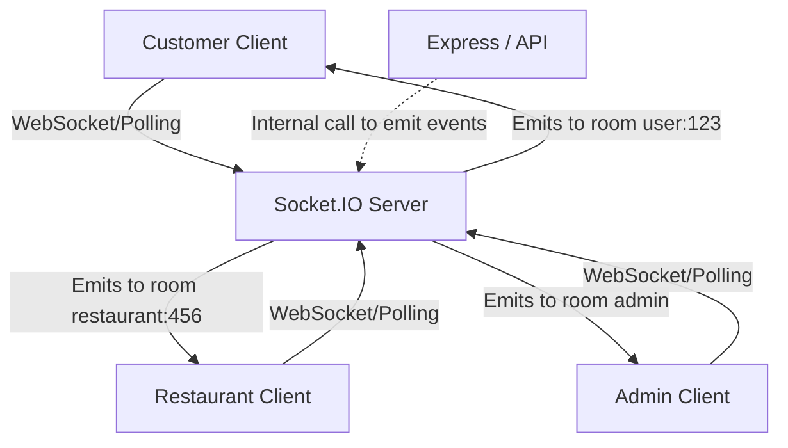

# Socket.IO Architecture

## Overview
Real-time capabilities are critical for a food delivery application. We use Socket.IO v4 with TypeScript to power live order status updates, new order notifications for restaurants, and a live tracking dashboard for customers.

## Architecture


## Room Strategy
Rooms are used to target events to specific user groups efficiently.

| Room Name | Pattern | Who Joins | Purpose |
|-----------|---------|-----------|--------|
| User Room | `user:{userId}` | Individual user | Personal notifications, order updates |
| Restaurant Room | `restaurant:{restaurantId}` | Restaurant owner | New orders, order updates for that restaurant |
| Admin Room | `admin` | All admins | Platform-wide events |
| Order Room | `order:{orderId}` | Customer + Restaurant owner | Specific order updates |

## Event Catalog

### Client → Server Events
| Event | Payload | Description | Auth Required |
|-------|---------|-------------|---------------|
| `authenticate` | `{ token }` | Authenticate socket connection | Yes |
| `joinRoom` | `{ room }` | Join a specific room | Yes |
| `leaveRoom` | `{ room }` | Leave a room | Yes |

### Server → Client Events
| Event | Payload | Description | Target |
|-------|---------|-------------|--------|
| `order:new` | `{ orderId, restaurant, items, total }` | New order placed | Restaurant room |
| `order:statusUpdate` | `{ orderId, status, updatedAt }` | Order status changed | User room + Order room |
| `order:cancelled` | `{ orderId, reason }` | Order cancelled | User room + Restaurant room |
| `notification:new` | `{ id, type, title, message }` | New notification | User room |
| `restaurant:orderReceived` | `{ orderId }` | Order confirmed received | Restaurant room |
| `connection:error` | `{ message }` | Connection error | Individual socket |

## Authentication & Lifecycle
1. **Connection**: Client connects, providing a JWT in the handshake: `socket.handshake.auth.token`.
2. **Verification**: A Socket.IO middleware verifies the token using the application's JWT secret. Unauthorized connections are rejected.
3. **Room Assignment**:
   - The user is assigned to their `user:{userId}` room automatically.
   - If the token payload indicates a `Restaurant Owner`, they join `restaurant:{restaurantId}`.
   - If the token payload indicates an `Admin`, they join `admin`.
4. **Disconnection**: On socket disconnect, the client is automatically removed from their rooms.

## Integration with Order Service
When the order status changes via REST API calls, the backend emits the event using a centralized socket service:
```typescript
// Pattern Example
OrderService.updateStatus = async (orderId, status) => {
    // ... DB updates
    socketService.emitOrderStatusUpdate(orderId, status);
};
```

## Error Handling & Resiliency
- **Connection Timeout**: Set to `10s`.
- **Reconnection**: Automatic, using exponential backoff.
- **Max Reconnection Attempts**: `10`.
- **Heartbeat**: 25s ping interval with a 5s timeout.

## Frontend Integration
- Provide a React Context (`SocketProvider`) to manage the singleton socket connection.
- Custom Hooks: `useSocket()`, `useOrderUpdates(orderId)`, `useNotifications()`.
- Connection management is strictly tied to the Auth state (connects on login, disconnects on logout).

## Scaling Considerations
- **Current**: Single-server setup on Render uses the default in-memory adapter.
- **Future**: When scaling to multiple backend instances, we will integrate `@socket.io/redis-adapter` alongside a Redis server to propagate events across instances.
