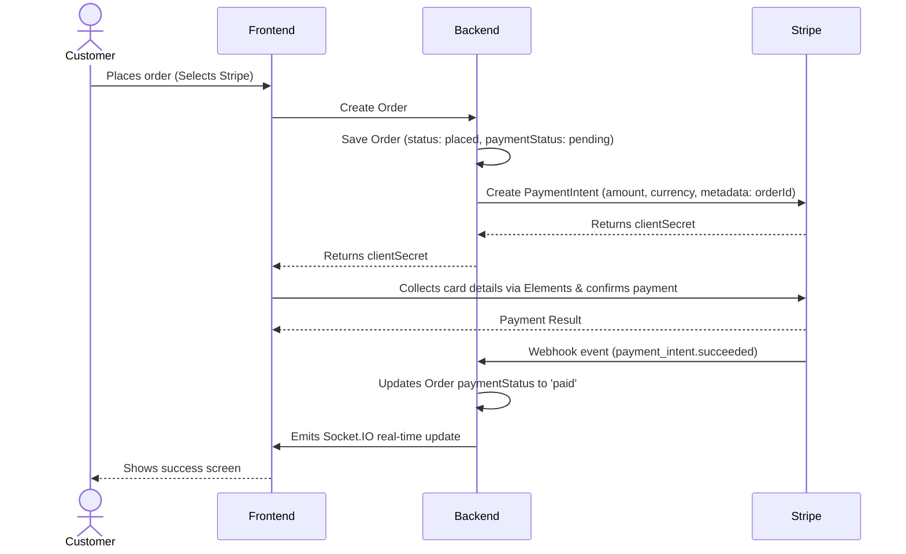
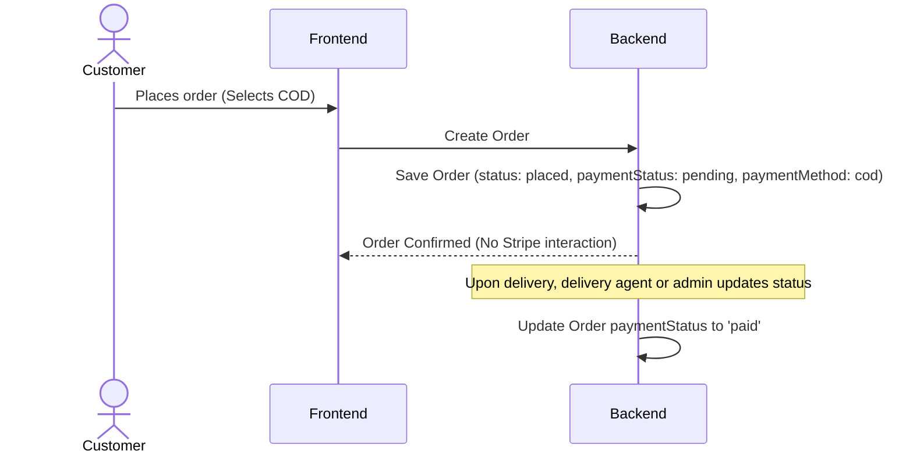

# Stripe Integration Plan

## Overview
Stripe is utilized as the primary online card payment processor. We also support Cash on Delivery (COD) as an alternative payment method. The integration relies heavily on the Stripe Node.js SDK and frontend Stripe Elements.

## Configuration
The following environment variables are required:
- `STRIPE_SECRET_KEY` (Backend)
- `STRIPE_WEBHOOK_SECRET` (Backend)
- `VITE_STRIPE_PUBLISHABLE_KEY` (Frontend)

Configuration initialization occurs in `src/config/stripe.ts`.

## Payment Flow

## Stripe Elements Integration (Frontend)
- Utilizes `@stripe/stripe-js` and `@stripe/react-stripe-js` packages.
- A Stripe Elements provider wraps the checkout flow.
- Collect card details using `CardElement` or `PaymentElement`.
- Payment is confirmed via `stripe.confirmCardPayment(clientSecret)`.

## Webhook Handling
A dedicated endpoint is exposed to handle Stripe events asynchronously:
- **Endpoint**: `POST /payments/webhook`
- **Parsing**: Uses `express.raw` to parse the raw body necessary for Stripe signature verification.
- **Events Handled**:
  - `payment_intent.succeeded` → Update paymentStatus to `paid`, adjust order status.
  - `payment_intent.payment_failed` → Update paymentStatus to `failed`.
  - `charge.refunded` → Update paymentStatus to `refunded`.
- **Idempotency**: Webhook logic must check if an order's payment status was already processed to avoid duplicate updates.

## Cash on Delivery (COD) Flow

## Refund Flow
- Admin initiates a refund via the Admin Dashboard.
- The backend calls `stripe.refunds.create({ payment_intent: paymentIntentId })`.
- The order's `paymentStatus` is updated to `refunded`.

## Currency & Amounts
- **Default Currency**: `USD` (Configurable via an environment variable).
- **Amount formatting**: Stripe processes amounts in the smallest currency unit (e.g., cents). All server-side calculated totals must be multiplied by 100 before being sent to Stripe.

## Security Considerations
- **Signature Verification**: Webhook payloads MUST be verified using the `STRIPE_WEBHOOK_SECRET` to prevent spoofing.
- **Server-Side Pricing**: Order totals are calculated entirely on the server; the frontend cannot dictate the charge amount.
- **Reconciliation**: Every `PaymentIntent` carries the `orderId` in its metadata to ensure safe database synchronization.
- **PCI Compliance**: No card data passes through or is logged on our server; Stripe Elements directly tokenize data.
