# Use Case Diagram and Specifications

This document outlines the primary use cases for the Food Delivery Web Application, detailing the interactions between the system's actors and its subsystems.

## Use Case Diagram

```mermaid
flowchart LR
    %% Actors
    Customer((Customer))
    Owner((Restaurant<br>Owner))
    Admin((Admin))
    System((System))

    %% Authentication Subsystem
    subgraph Authentication
        direction TB
        UC1([Register])
        UC2([Login])
        UC3([Logout])
        UC4([Verify Email])
        UC5([Forgot Password])
        UC6([Reset Password])
    end

    %% Marketplace Subsystem
    subgraph Marketplace
        direction TB
        UC7([Browse Restaurants])
        UC8([Search & Filter])
        UC9([View Restaurant Details])
        UC10([Browse Menu])
        UC11([Rate & Review])
    end

    %% Order Subsystem
    subgraph Orders
        direction TB
        UC12([Manage Cart])
        UC13([Apply Coupon])
        UC14([Checkout - Stripe/COD])
        UC15([Track Order])
        UC16([Order History/Reorder])
        UC17([Cancel Order])
    end

    %% Restaurant Management Subsystem
    subgraph Restaurant Management
        direction TB
        UC18([Manage Restaurant Profile])
        UC19([Manage Menu & Meals])
        UC20([View Incoming Orders])
        UC21([Update Order Status])
        UC22([View Revenue])
    end

    %% Admin Subsystem
    subgraph Admin Management
        direction TB
        UC23([Manage Users])
        UC24([Manage Restaurants])
        UC25([Manage Categories])
        UC26([Manage Coupons])
        UC27([View Analytics])
    end

    %% System Subsystem
    subgraph System Automated Actions
        direction TB
        UC28([Send Email Verification])
        UC29([Send Password Reset])
        UC30([Process Payment])
        UC31([Send Notification])
        UC32([Calculate Fee/Tax])
    end

    %% Connections - Customer
    Customer --> UC1
    Customer --> UC2
    Customer --> UC3
    Customer --> UC5
    Customer --> UC6
    Customer --> UC7
    Customer --> UC8
    Customer --> UC9
    Customer --> UC10
    Customer --> UC11
    Customer --> UC12
    Customer --> UC13
    Customer --> UC14
    Customer --> UC15
    Customer --> UC16
    Customer --> UC17

    %% Connections - Owner
    Owner --> UC1
    Owner --> UC2
    Owner --> UC3
    Owner --> UC18
    Owner --> UC19
    Owner --> UC20
    Owner --> UC21
    Owner --> UC22

    %% Connections - Admin
    Admin --> UC2
    Admin --> UC3
    Admin --> UC23
    Admin --> UC24
    Admin --> UC25
    Admin --> UC26
    Admin --> UC27

    %% Connections - System
    System --> UC4
    System --> UC28
    System --> UC29
    System --> UC30
    System --> UC31
    System --> UC32
    
    %% Implicit connections
    UC14 -.-> UC30
    UC14 -.-> UC32
    UC15 -.-> UC31
    UC21 -.-> UC31
```

## Use Case Table

| ID | Name | Actor(s) | Description | Preconditions |
|----|------|----------|-------------|---------------|
| **UC-001** | Register | Customer, Owner | User creates a new account on the platform. | User is not logged in. |
| **UC-002** | Login | Customer, Owner, Admin | User authenticates using email and password. | User has a registered account. |
| **UC-003** | Logout | Customer, Owner, Admin | User ends their current authenticated session. | User is logged in. |
| **UC-004** | Verify Email | System, Customer | Verifies a user's email address via a token link. | User has recently registered. |
| **UC-005** | Forgot Password | Customer, Owner, Admin | User requests a password reset link. | User must know their registered email. |
| **UC-006** | Reset Password | Customer, Owner, Admin | User sets a new password using a reset token. | User has a valid reset token. |
| **UC-007** | Browse Restaurants | Customer | Customer views a list of available restaurants. | None. |
| **UC-008** | Search/Filter | Customer | Customer searches or filters restaurants by name, cuisine, etc. | None. |
| **UC-009** | View Restaurant Details | Customer | Customer views detailed info and reviews for a restaurant. | Restaurant exists and is active. |
| **UC-010** | Browse Menu | Customer | Customer views categories and meals for a selected restaurant. | Customer is on the restaurant's page. |
| **UC-011** | Rate & Review | Customer | Customer leaves a rating and review for a delivered order. | Customer has a completed order from the restaurant. |
| **UC-012** | Manage Cart | Customer | Customer adds, updates, or removes meals in their cart. | Customer is logged in and viewing meals. |
| **UC-013** | Apply Coupon | Customer | Customer applies a discount code to their cart total. | Customer has items in the cart. |
| **UC-014** | Checkout | Customer, System | Customer proceeds to pay via Stripe or Cash on Delivery (COD). | Cart is not empty; minimum order amount met. |
| **UC-015** | Track Order | Customer | Customer tracks the real-time status of their active order. | Customer has an active order. |
| **UC-016** | View Order History | Customer | Customer views a list of all their past orders and can reorder. | Customer is logged in. |
| **UC-017** | Cancel Order | Customer | Customer cancels an order before it is accepted by the restaurant. | Order status is 'Pending'. |
| **UC-018** | Manage Restaurant Profile | Owner | Owner updates restaurant details, logo, opening hours, etc. | Owner is logged in and owns the restaurant. |
| **UC-019** | Manage Menu | Owner | Owner creates, updates, or deletes menu categories and meals. | Owner is logged in and owns the restaurant. |
| **UC-020** | View Incoming Orders | Owner | Owner views real-time incoming orders from customers. | Owner is logged in and restaurant is open. |
| **UC-021** | Update Order Status | Owner | Owner changes an order's status (Accepted, Preparing, Delivered). | Owner has an active incoming order. |
| **UC-022** | View Revenue | Owner | Owner views earnings and order statistics for their restaurant. | Owner is logged in. |
| **UC-023** | Manage Users | Admin | Admin views, bans, or manages users and roles on the platform. | Admin is logged in. |
| **UC-024** | Manage Restaurants | Admin | Admin approves, rejects, or suspends restaurants. | Admin is logged in. |
| **UC-025** | Manage Categories | Admin | Admin manages global food categories (e.g., Pizza, Burgers). | Admin is logged in. |
| **UC-026** | Manage Coupons | Admin | Admin creates, updates, and deletes global promotional coupons. | Admin is logged in. |
| **UC-027** | View Analytics | Admin | Admin views platform-wide revenue, users, and order statistics. | Admin is logged in. |
| **UC-028** | Send Emails | System | System automatically sends transactional emails (verification, reset). | Triggered by user action (register, forgot pass). |
| **UC-029** | Process Payment | System | System processes card payments securely via Stripe gateway. | Customer submits checkout with a card. |
| **UC-030** | Send Notification | System | System sends Socket.IO real-time notifications for order updates. | Order status changes. |
| **UC-031** | Calculate Fee/Tax | System | System calculates delivery fees, service fees, and taxes for an order. | Customer views cart/checkout. |
