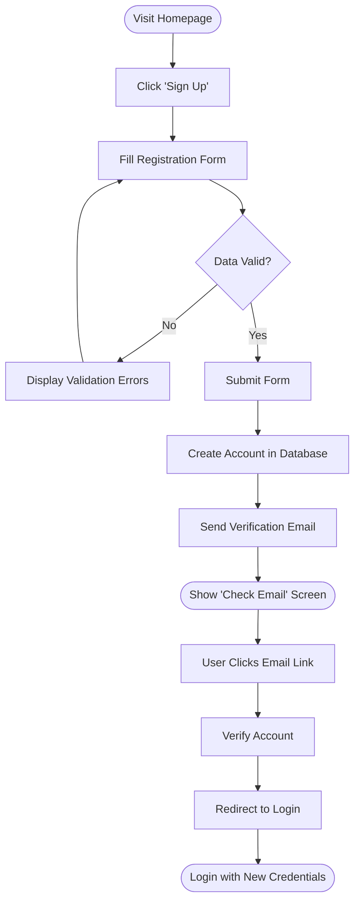
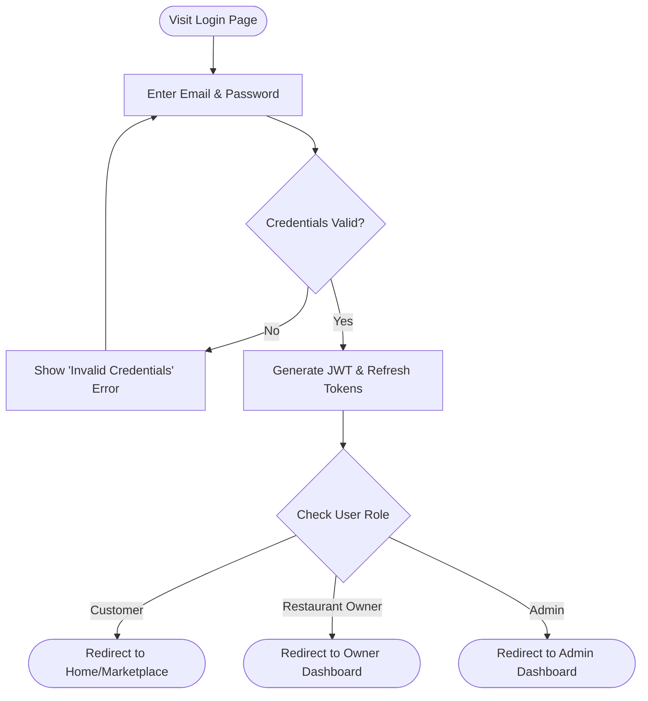
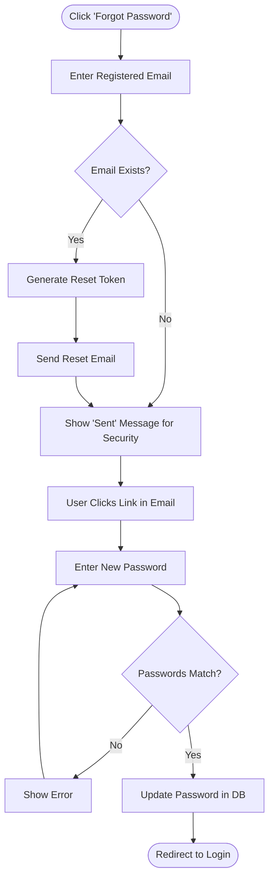
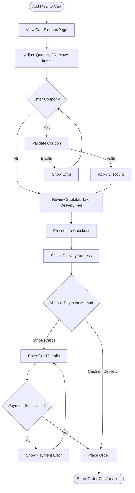
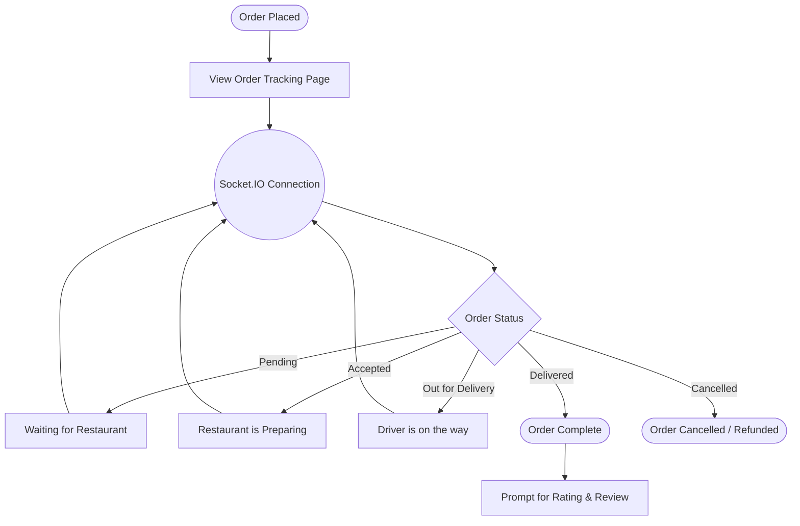
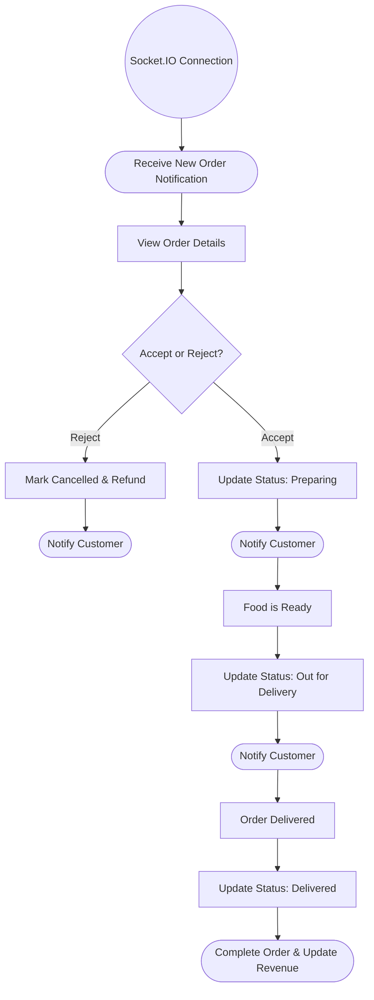
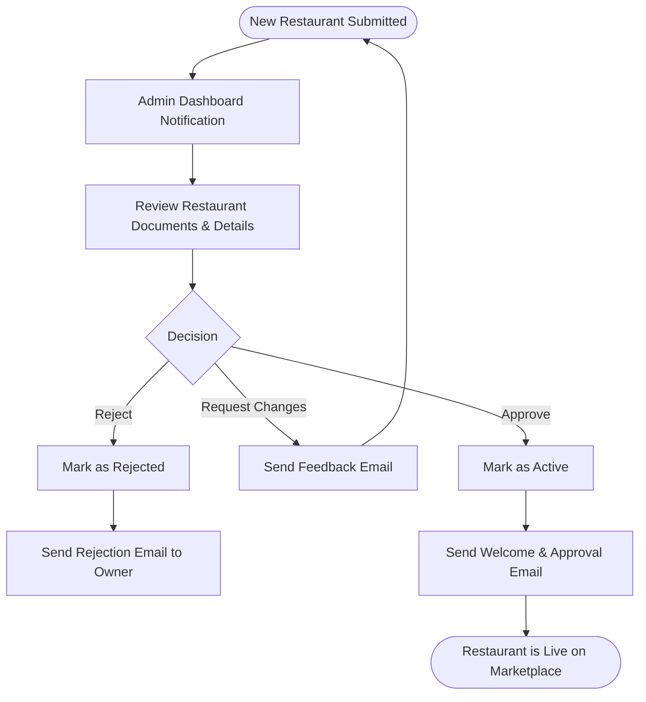

# User Flows

This document visualizes the critical user journeys through the Food Delivery Web Application.

## 1. Registration Flow
**Description:** The complete process for a new user to sign up, verify their email, and log in to the system.



## 2. Login Flow
**Description:** The process for an existing user to authenticate and access their respective dashboard based on their role.



## 3. Password Reset Flow
**Description:** The sequence of steps a user takes to recover access to their account if they forget their password.



## 4. Restaurant Discovery Flow
**Description:** How a customer finds a restaurant, browses the menu, and decides what to order.

```mermaid
flowchart TD
    A([Home Page]) --> B[View Featured / Popular]
    A --> C[Search or Select Category]
    C --> D[View Restaurant Listing]
    D --> E[Apply Filters (Rating, Cuisine)]
    E --> F[Select Restaurant]
    F --> G[View Restaurant Profile & Reviews]
    G --> H[Browse Menu Categories]
    H --> I[View Meal Details]
    I --> J([Select Meal for Order])
```

## 5. Ordering Flow
**Description:** The checkout process, including cart management, coupon application, and payment selection.



## 6. Order Tracking Flow
**Description:** The post-purchase journey where the customer tracks their order in real-time.



## 7. Restaurant Owner: Order Processing Flow
**Description:** How a restaurant owner receives, manages, and completes incoming orders.



## 8. Admin: Restaurant Approval Flow
**Description:** The process an admin follows to onboard a new restaurant to the platform.


